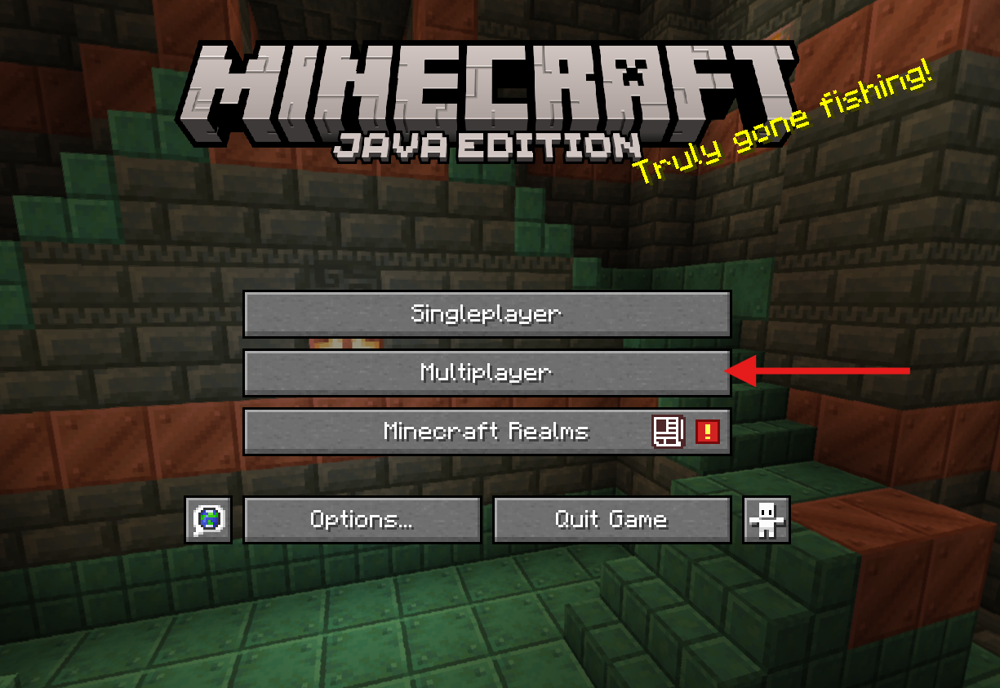
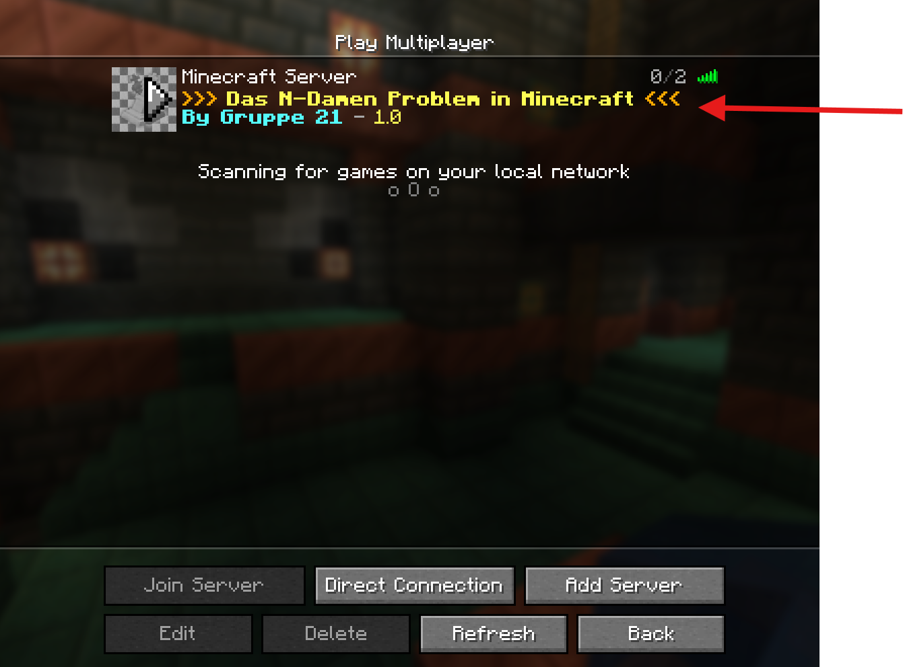
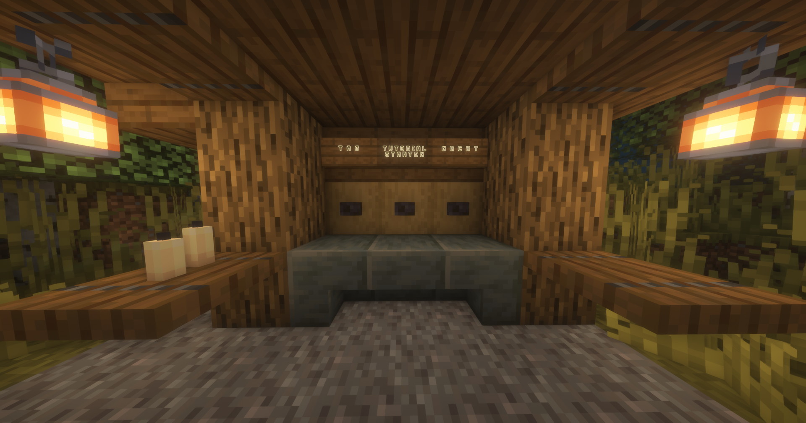

# Anleitung für das Minecraft-Tutorial zum N-Damenproblem

## Inhaltsverzeichnis
- [Anleitung für das Minecraft-Tutorial zum N-Damenproblem](#anleitung-für-das-minecraft-tutorial-zum-n-damenproblem)
  - [Inhaltsverzeichnis](#inhaltsverzeichnis)
  - [Installation und Start](#installation-und-start)
    - [Voraussetzungen](#voraussetzungen)
    - [Schritt-für-Schritt-Anleitung](#schritt-für-schritt-anleitung)
      - [Download](#download)
      - [Ausführen](#ausführen)
      - [Server starten](#server-starten)
  - [Minecraft-Steuerung](#minecraft-steuerung)
  - [Tutorialübersicht](#tutorialübersicht)
    - [Einstieg ins Tutorial](#einstieg-ins-tutorial)
    - [Navigation im Tutorial](#navigation-im-tutorial)
    - [Steuerung der Tutorial-Items](#steuerung-der-tutorial-items)
    - [Abschluss eines Levels](#abschluss-eines-levels)
  - [Zusätzliche Tutorial-Funktionen](#zusätzliche-tutorial-funktionen)
    - [Figuren setzen](#figuren-setzen)
    - [Bewegungen und Bedrohungen](#bewegungen-und-bedrohungen)
  - [Dev-Menü Steuerung](#dev-menü-steuerung)
    - [Funktionen des Dev-Menüs](#funktionen-des-dev-menüs)
      - [Schachbrett-Optionen](#schachbrett-optionen)
      - [Figuren-Optionen](#figuren-optionen)
      - [Backtracking-Optionen](#backtracking-optionen)
      - [Ästhetische Anpassungen](#ästhetische-anpassungen)
  - [Häufige Probleme und Lösungen](#häufige-probleme-und-lösungen)
    - [Minecraft öffnet sich nicht](#minecraft-öffnet-sich-nicht)
    - [Keine Verbindung zum Server](#keine-verbindung-zum-server)
    - [Spiel hängt oder läuft langsam](#spiel-hängt-oder-läuft-langsam)
  - [Häufige Probleme und Lösungen](#häufige-probleme-und-lösungen-1)

## Installation und Start
### Voraussetzungen
- **Java 21** (Falls nicht installiert, wird ein Installer bereitgestellt - [siehe 3.](#ausführen)).
- Internetverbindung
- Ein PC mit Windows 10 oder höher wird empfohlen.

### Schritt-für-Schritt-Anleitung

#### Download
- Lade die neueste Version des Tutorials von der [Release-Seite](https://github.com/LionStar303/AlgDat_Damen/releases) herunter.
- Entpacke die Datei in einen beliebigen Ordner

#### Ausführen
1. **Wenn Java 21 installiert ist**, starte die Datei `AlgDat_Start.bat`.
2. **Falls dein PC weniger leistungsstark ist**, benutze die Datei `AlgDat_Start_Low.bat`.
3. **Wenn Java nicht installiert ist**:
   - Öffne den Ordner `Java`.
   - Führe die Datei `javaInstaller.bat` aus.
   - Starte anschließend die `.bat`-Datei wie oben beschrieben.

#### Server starten
1. Zwei Terminal-Fenster öffnen sich automatisch und laden die notwendigen Dateien. **Diese Fenster müssen während des Tutorials geöffnet bleiben**
2. Nach kurzer Zeit sollte Minecraft starten, und du wirst automatisch auf den Server verbunden.

**Falls dies nicht funktioniert:**
- Gehe über das Minecraft-Hauptmenü:
  - **Multiplayer > Wähle den ersten Server in der Liste aus und klicke doppelt darauf.**
  
  
  
---

## Minecraft-Steuerung

- **Laufen:** `W`, `A`, `S`, `D`-Tasten
- **Umschauen:** Mausbewegen
- **Springen:** `Leertaste`
- **Mausklick:** Nutze Items oder aktiviere Objekte
- **Inventar schließen:** `E`-Taste
- **Item in linke Hand legen:** `F`-Taste

---

## Tutorialübersicht

### Einstieg ins Tutorial
1. Nach dem Serverbeitritt kannst du am Spawnpunkt das Tutorial starten.
2. Nutze die Buttons oder Schilder:
   - **Tag/Nacht wechseln**.
   - **Tutorial starten**.

### Navigation im Tutorial
- Das Tutorial besteht aus verschiedenen Leveln, die Schritt für Schritt durchlaufen werden.
- Du wirst immer zum Eingangstor eines Levels teleportiert. Von dort kannst du zu den Schachbrettern gehen. Folge einfach dem NPC.
- **der NPC erklärt die Aufgaben in jedem Level.**

### Steuerung der Tutorial-Items
- **Weiter:** Führt den Ablauf des Tutorials fort.
- **Wiederholen:** Wiederholt die aktuelle Aufgabe.
- **Zurück:** geht zum vorherigen Schritt zurück, **ACHTUNG:** dieser muss dann wiederholt werden.

### Abschluss eines Levels
- **Bei erfolgreichem Abschluss:**
  - Ein Blitz schlägt am Ausgangstor ein.
  - Ein blaues Feuer erscheint.

- **Um ins nächste Level zu gelangen:**
  - Auf das blaue Feuer stellen und **Flohpulver** in der Luft verwenden oder
  - Rechtsklick auf das blaue Feuer mit dem **Flohpulver**.

---

## Zusätzliche Tutorial-Funktionen

### Figuren setzen
- **Dame setzen (gelber Farbstoff).**
- **Springer setzen (orangener Farbstoff).**
- **Superdame setzen (hellblauer Farbstoff).**

### Bewegungen und Bedrohungen
- **Bewegung markieren (magentafarbener Farbstoff).**
- **Bedrohungen anzeigen (brauner Farbstoff).**

---

## Dev-Menü Steuerung

### Funktionen des Dev-Menüs

#### Schachbrett-Optionen
- **Spawne Schachbrett (Diamant):** Erstellt ein neues Schachbrett in der aktuellen Größe.
- **Entferne Schachbrett (Barrier):** Löscht das aktuelle Schachbrett.
- **Größe ändern (Redstone-Fackel):** Erhöht oder verringert die Größe des nächsten zu spawnenden Schachbretts.
- **Teppiche anzeigen (Roter Teppich):** Schaltet die Anzeige der Bedrohungszonen auf dem Brett ein oder aus.

#### Figuren-Optionen
- **Spawne Dame (Eisenhelm):** Setzt oder entfernt eine Dame auf dem Brett.
- **Rotiere Figuren (Kompass):** Rotiert die Figuren auf dem Brett, um ihre Bewegungsmöglichkeiten zu analysieren.
- **Entferne alle Figuren (TNT):** Löscht alle Figuren vom Schachbrett.

#### Backtracking-Optionen
- **Backtracking starten (Diamantschwert):** Startet das Backtracking, um das Brett zu lösen.
- **Nächster Schritt (Eisenpickel):** Führt den nächsten Schritt des Backtracking-Algorithmus aus.
- **Schritt zurück (Goldene Hacke):** Geht einen Schritt im Algorithmus zurück.
- **Backtracking Animation (Diamantaxt):** Löst das Brett schrittweise, wobei die Animation alle Bewegungen zeigt.

#### Ästhetische Anpassungen
- **Ändere weiße Blöcke (Weißglasierte Terrakotta):** Ändert das Aussehen der weißen Felder.
- **Ändere schwarze Blöcke (Schwarze Blöcke):** Passt das Aussehen der schwarzen Felder an.

---

## Häufige Probleme und Lösungen

### Minecraft öffnet sich nicht
- Stelle sicher, dass Java 21 korrekt installiert ist.
- Prüfe, ob die `.bat`-Datei mit Administratorrechten ausgeführt wurde.

### Keine Verbindung zum Server
- Stelle sicher, dass du den richtigen Server auswählst.
  - siehe [Server starten](#server-starten)

### Spiel hängt oder läuft langsam
- Nutze `AlgDat_Start_Low.bat` für eine ressourcenschonende Version.

---

## Häufige Probleme und Lösungen
**Minecraft öffnet sich nicht:**
- Stelle sicher, dass Java 21 korrekt installiert ist.

- Prüfe, ob die .bat-Datei mit Administratorrechten ausgeführt wurde.

**Keine Verbindung zum Server:**

- Stelle sicher, dass du den richtigen Server auswählst. 

**Spiel hängt oder läuft langsam:**
- Nutze AlgDat_Start_Low.bat für eine ressourcenschonende Version.
---

**Viel Spaß beim Lösen des n-Damen-Problems!**

